# System Patterns

## Architecture Overview

**dockertestx** leverages the underlying [dockertest](https://github.com/ory/dockertest) library and builds a unified API layer on top of it. The overall architecture is structured into the following layers:

```
┌─────────────────────────────────────────────────────┐
│                Application Tests                   │
└───────────────────────────┬─────────────────────────┘
                            │
┌───────────────────────────v─────────────────────────┐
│                    dockertestx API                  │
│                                                     │
│  ┌─────────┐  ┌─────────┐  ┌─────────┐  ┌─────────┐ │
│  │  MySQL  │  │ Postgres│  │  Redis  │  │DynamoDB │ │
│  └─────────┘  └─────────┘  └─────────┘  └─────────┘ │
│         ...Other Supported Services...             │
└───────────────────────────┬─────────────────────────┘
                            │
┌───────────────────────────v─────────────────────────┐
│                     dockertest                      │
└───────────────────────────┬─────────────────────────┘
                            │
┌───────────────────────────v─────────────────────────┐
│                  Docker Engine API                  │
└─────────────────────────────────────────────────────┘
```

## Key Design Patterns

### 1. Factory Pattern

Each service's container creation and client connection are abstracted through factory functions:

```go
// Example: Create a MySQL container and return a connected db.SQL instance
func NewMySQL(t testing.TB) (*sql.DB, func())

// Example: Create a Redis container and return a connected redis.Client instance
func NewRedis(t testing.TB) (*redis.Client, func())

// Example: Create a DynamoDB container and return a connected dynamodb.Client instance
func NewDynamoDB(t testing.TB) (*dynamodb.Client, func())
```

Each factory function manages the entire lifecycle of the container, from startup and connection establishment to cleanup after test execution.

### 2. Options Pattern

To customize container configurations, dockertestx adopts the **functional options pattern**:

```go
// Define the type for option functions
type RunOption func(*dockertest.RunOptions)

// Customizable factory function
func NewMySQLWithOptions(t testing.TB, runOpts []RunOption, hostOpts ...func(*docker.HostConfig)) (*sql.DB, func())
```

This approach provides **default configurations** while allowing users to modify specific settings as needed.

### 3. Resource Management Strategy

To ensure efficient resource management during tests, the following strategies are employed:

- **Cleanup function** – Each factory function returns a cleanup function to release resources.  
- **Deferred execution** – Using `defer cleanup()` ensures reliable resource cleanup.  
- **Context utilization** – A timeout-based context controls connection establishment.  

```go
// Example cleanup function
cleanup := func() {
    if err := db.Close(); err != nil {
        t.Logf("failed to close DB: %s", err)
    }
    if err := pool.Purge(resource); err != nil {
        t.Logf("failed to remove container: %s", err)
    }
}
```

### 4. Helper Function Pattern

To simplify test data preparation, dockertestx provides dedicated **helper functions** for each service type:

```go
// Prepare database schema and data
func PrepDatabase(t testing.TB, db *sql.DB, setups ...InitialDBSetup) error

// Prepare Redis data
func PrepRedis(t testing.TB, client *redis.Client, items map[string]interface{}, exp time.Duration) error

// Prepare a DynamoDB table
func PrepTable(t testing.TB, client *dynamodb.Client, input *dynamodb.CreateTableInput) error
```

These helpers **reduce boilerplate code** and allow developers to focus on the essential aspects of testing.

## Component Relationships

dockertestx components are structured as follows:

```mermaid
graph TD
    A[Main Package: dockertestx] --> B[SQL DB Component]
    A --> C[Redis Component]
    A --> D[Memcached Component]
    A --> E[MinIO Component]
    A --> F[DynamoDB Component]
    
    B --> G[MySQL]
    B --> H[PostgreSQL]
    
    G --> I[NewMySQL]
    G --> J[NewMySQLWithOptions]
    G --> K[PrepDatabase]
    
    C --> L[NewRedis]
    C --> M[NewRedisWithOptions]
    C --> N[PrepRedis]
    C --> O[PrepRedisList]
    C --> P[PrepRedisHash]
    C --> Q[PrepRedisSet]
    C --> R[PrepRedisSortedSet]
    
    D --> S[NewMemcached]
    D --> T[NewMemcachedWithOptions]
    D --> U[PrepMemcached]
    
    E --> V[NewMinIO]
    E --> W[NewMinIOWithOptions]
    E --> X[PrepBucket]
    E --> Y[UploadObject]
    E --> Z[PrepS3Objects]
    
    F --> AA[NewDynamoDB]
    F --> AB[NewDynamoDBWithOptions]
    F --> AC[PrepTable]
    F --> AD[PrepItems]
```



## Key Technical Decisions

1. **Minimal external dependencies** – Only essential third-party packages are used.  
2. **Unified API design** – Consistent patterns across all services to minimize learning costs.  
3. **Flexible option design** – Works with default settings while allowing granular customization.  
4. **Test-driven design** – Prioritizing testability and ease of use.  
5. **dockertest dependency** – Abstracts Docker operations through dockertest.  

## Error Handling Strategy

Error handling is based on the following principles:

1. **Early return** – Fail fast with cleanup if an error occurs.  
2. **Contextual errors** – Provide meaningful error messages with context.  
3. **Test helper utilities** – Use `t.Helper()` and `t.Fatalf()` to improve debugging clarity in test environments.  

```go
if err != nil {
    _ = pool.Purge(resource)
    t.Fatalf("failed to connect to %s: %s", driverName, err)
}
```

## Extensibility Strategy

When adding support for new services, dockertestx follows this structured approach:

1. **Create a dedicated file** (e.g., `redis.go`).  
2. **Implement a basic factory function** (e.g., `NewRedis`).  
3. **Implement an option-enabled factory function** (e.g., `NewRedisWithOptions`).  
4. **Implement helper functions if needed** (e.g., `PrepRedis`).  
5. **Verify functionality through test cases** (e.g., `redis_test.go`).  

By following this pattern, dockertestx maintains **API consistency** and usability while making it easy to integrate new services seamlessly.
