# System Patterns

## Architecture Overview

**dockertestx** leverages the underlying [dockertest](https://github.com/ory/dockertest) library and builds a modular API layer on top of it. The architecture has been restructured into dedicated packages for each service type, allowing more flexibility and reducing unnecessary dependencies. The overall architecture is structured into the following layers:

```
┌─────────────────────────────────────────────────────┐
│                Application Tests                   │
└───────────────────────────┬─────────────────────────┘
                            │
┌───────────────────────────v─────────────────────────┐
│              dockertestx Package Ecosystem          │
│                                                     │
│  ┌─────────┐  ┌─────────┐  ┌─────────┐  ┌─────────┐ │
│  │   sql   │  │  redis  │  │memcached│  │ dynamodb│ │
│  └─────────┘  └─────────┘  └─────────┘  └─────────┘ │
│  ┌─────────┐  ┌─────────┐                           │
│  │  minio  │  │internal │                           │
│  └─────────┘  └─────────┘                           │
└───────────────────────────┬─────────────────────────┘
                            │
┌───────────────────────────v─────────────────────────┐
│                     dockertest                      │
└───────────────────────────┬─────────────────────────┘
                            │
┌───────────────────────────v─────────────────────────┐
│                  Docker Engine API                  │
└─────────────────────────────────────────────────────┘
```

## Key Design Patterns

### 1. Factory Pattern

Each service's container creation and client connection are abstracted through factory functions within their respective packages:

```go
// Example: Create a MySQL container and return a connected db.SQL instance
// In the sql package
func RunMySQL(t testing.TB) (*sql.DB, func())

// Example: Create a Redis container and return a connected redis.Client instance
// In the redis package
func RunRedis(t testing.TB) (*redis.Client, func())

// Example: Create a DynamoDB container and return a connected dynamodb.Client instance
// In the dynamodb package
func RunDynamoDB(t testing.TB) (*dynamodb.Client, func())
```

Each factory function manages the entire lifecycle of the container, from startup and connection establishment to cleanup after test execution.

### 2. Options Pattern

To customize container configurations, each package in dockertestx adopts the **functional options pattern**:

```go
// In the sql package
// Define the type for option functions
type RunOption func(*dockertest.RunOptions)

// Customizable factory function
func RunMySQLWithOptions(t testing.TB, runOpts []RunOption, hostOpts ...func(*docker.HostConfig)) (*sql.DB, func())
```

This approach provides **default configurations** while allowing users to modify specific settings as needed.

### 3. Resource Management Strategy

To ensure efficient resource management during tests, the following strategies are employed:

- **Cleanup function** – Each factory function returns a cleanup function to release resources.  
- **Deferred execution** – Using `defer cleanup()` ensures reliable resource cleanup.  
- **Context utilization** – A timeout-based context controls connection establishment.  

```go
// Example cleanup function
cleanup := func() {
    if err := db.Close(); err != nil {
        t.Logf("failed to close DB: %s", err)
    }
    if err := pool.Purge(resource); err != nil {
        t.Logf("failed to remove container: %s", err)
    }
}
```

### 4. Helper Function Pattern

To simplify test data preparation, each package in dockertestx provides dedicated **helper functions** for its service type:

```go
// In the sql package - Prepare database schema and data
func PrepDatabase(t testing.TB, db *sql.DB, setups ...InitialDBSetup) error

// In the redis package - Prepare Redis data
func PrepRedis(t testing.TB, client *redis.Client, items map[string]interface{}, exp time.Duration) error

// In the dynamodb package - Prepare a DynamoDB table
func PrepTable(t testing.TB, client *dynamodb.Client, input *dynamodb.CreateTableInput) error
```

These helpers **reduce boilerplate code** and allow developers to focus on the essential aspects of testing.

## Component Relationships

dockertestx components are now organized into dedicated packages, structured as follows:

```mermaid
graph TD
    A[dockertestx Ecosystem] --> B[sql Package]
    A --> C[redis Package]
    A --> D[memcached Package]
    A --> E[minio Package]
    A --> F[dynamodb Package]
    A --> G[internal Package]
    
    B --> H[MySQL]
    B --> I[PostgreSQL]
    
    H --> J[RunMySQL]
    H --> K[RunMySQLWithOptions]
    B --> L[PrepDatabase]
    
    C --> M[RunRedis]
    C --> N[RunRedisWithOptions]
    C --> O[PrepRedis]
    C --> P[PrepRedisList]
    C --> Q[PrepRedisHash]
    C --> R[PrepRedisSet]
    C --> S[PrepRedisSortedSet]
    
    D --> T[RunMemcached]
    D --> U[RunMemcachedWithOptions]
    D --> V[PrepMemcached]
    
    E --> W[RunMinIO]
    E --> X[RunMinIOWithOptions]
    E --> Y[PrepBucket]
    E --> Z[UploadObject]
    E --> AA[PrepS3Objects]
    
    F --> AB[RunDynamoDB]
    F --> AC[RunDynamoDBWithOptions]
    F --> AD[PrepTable]
    F --> AE[PrepItems]
    
    G --> AF[Shared Utilities]
```



## Key Technical Decisions

1. **Minimal external dependencies** – Only essential third-party packages are used.  
2. **Unified API design** – Consistent patterns across all services to minimize learning costs.  
3. **Flexible option design** – Works with default settings while allowing granular customization.  
4. **Test-driven design** – Prioritizing testability and ease of use.  
5. **dockertest dependency** – Abstracts Docker operations through dockertest.  

## Error Handling Strategy

Error handling is based on the following principles:

1. **Early return** – Fail fast with cleanup if an error occurs.  
2. **Contextual errors** – Provide meaningful error messages with context.  
3. **Test helper utilities** – Use `t.Helper()` and `t.Fatalf()` to improve debugging clarity in test environments.  

```go
if err != nil {
    _ = pool.Purge(resource)
    t.Fatalf("failed to connect to %s: %s", driverName, err)
}
```

## Extensibility Strategy

With the new package-based architecture, adding support for new services follows this structured approach:

1. **Create a dedicated package** (e.g., `mongodb/`).  
2. **Implement a basic factory function** (e.g., `RunMongoDB`).  
3. **Implement an option-enabled factory function** (e.g., `RunMongoDBWithOptions`).  
4. **Implement helper functions if needed** (e.g., `PrepCollection`).  
5. **Verify functionality through test cases** (e.g., `mongodb_test.go`).  

Benefits of the package-based approach:
1. **Selective imports** - Users only need to import packages for services they actually use.
2. **Reduced dependencies** - Each package only imports the client libraries it needs.
3. **Clearer API boundaries** - Functions are naturally namespaced by their package.
4. **Independent versioning potential** - In the future, packages could potentially be versioned independently.

By following this pattern, dockertestx maintains **API consistency** and usability while making it easy to integrate new services seamlessly.
